# ClaimShield Nexus (Axon)

**A unified platform that identifies suspicious healthcare claims and coordinated networks, predicts future risk, explains the evidence, and prioritizes cases for Special Investigations Unit (SIU) review.**

> Code finds and scores. AI reads what code cannot and argues both sides. Money is held before it leaves. A person always decides.

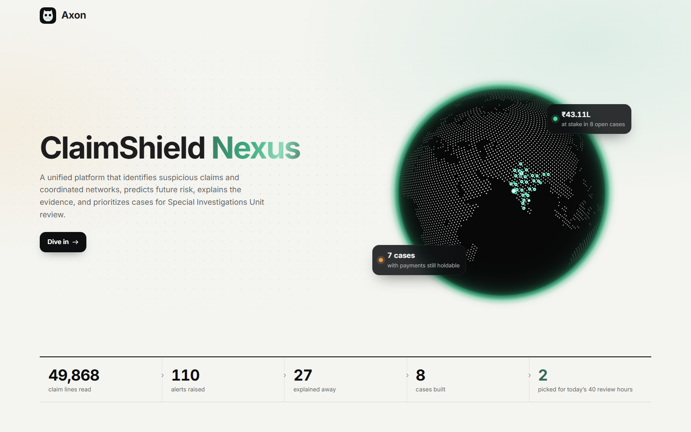

**All data is synthetic.** No real patient, member, provider or payer data is used anywhere in this repo.

---

## Contents

- [What it does](#what-it-does)
- [Screens](#screens)
- [How it works](#how-it-works)
- [Responsible AI](#responsible-ai)
- [Run it](#run-it)
- [Repo layout](#repo-layout)
- [Team](#team)

---

## What it does

Fraud, waste and abuse (FWA) teams drown in alerts. Most are innocent; the expensive frauds hide as many small, normal-looking claims spread across linked providers. Axon turns ~50,000 claim lines into a short, ranked list of cases a person can act on today, with the evidence for each one.

| | |
|---|---|
| **Detects** | Rules, peer anomaly (risk-adjusted), temporal patterns and graph communities (Louvain) over providers, owners, bank accounts, members and facilities |
| **Explains away** | Innocent explanations (sicker patients, regional events, group practices…) clear alerts before anyone wastes time on them. Hard signals are never auto-cleared |
| **Predicts** | 30/60/90-day risk that a case repeats or spreads to linked providers |
| **Verifies records** | Medical records are checked against claims, referrals and dates, including instructions hidden in records aimed at the AI |
| **Argues** | An **Evidence Court**: a prosecutor and a defense agent argue from the same evidence; a verifier strikes anything they can't back up |
| **Prioritizes** | An OR-Tools optimizer fits cases into real investigator hours and shows where each hour recovers the most |
| **Stress-tests itself** | **Fraud Twin**: describe a new fraud scheme in plain words, Axon plants it in a sandbox copy, re-runs detection and proposes a fix for a person to approve |

---

## Screens

### Home: today's plan
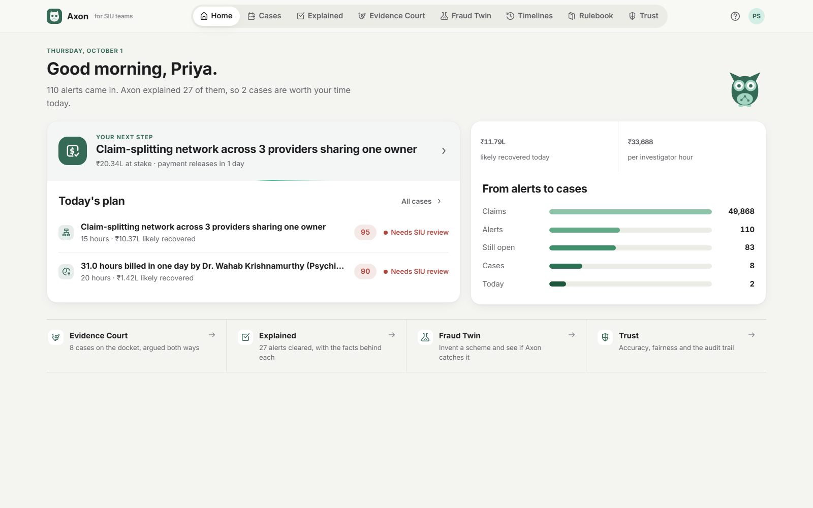

### Cases: where your hours go furthest
Investigator capacity vs. likely recovery. The first hours recover the most; the plan picks cases to fit the hours available.
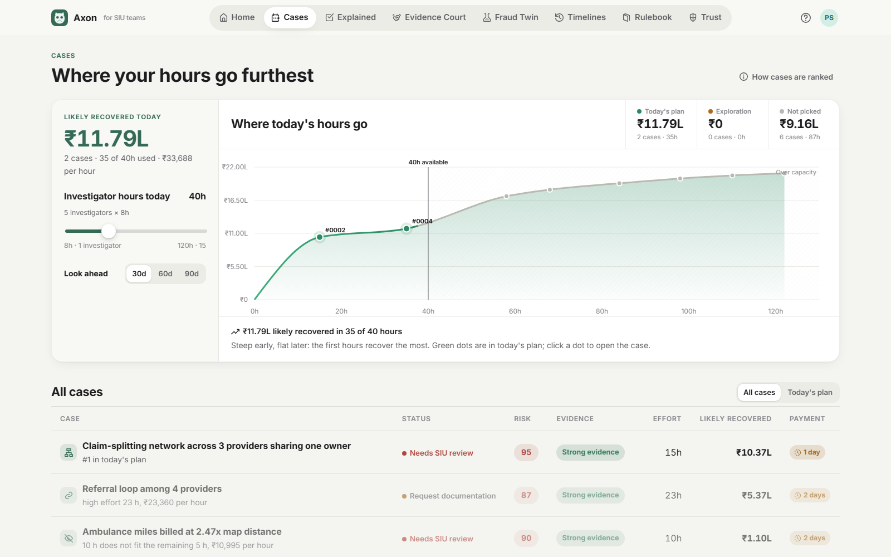

### A case
Risk, confidence, what could make it legitimate and what's missing, next to a human review panel. Nothing happens until a person decides.
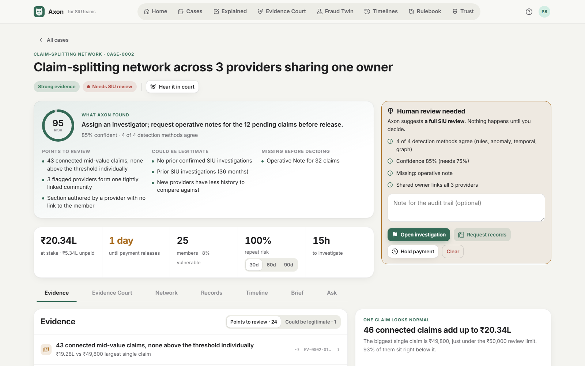

### Network
The providers, owners, bank accounts and members behind a case, and which linked providers are likely to be next.
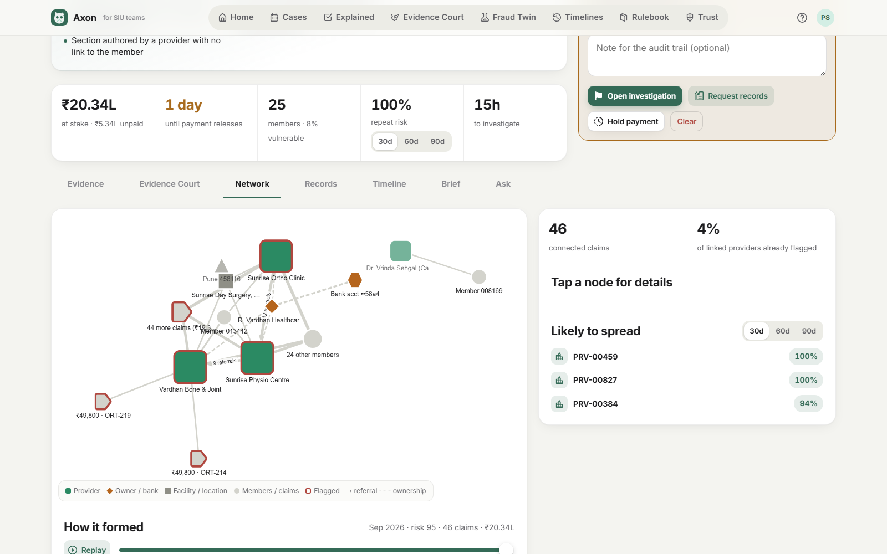

### Evidence Court
Prosecution and defense argue live from the same evidence. Every statement carries evidence IDs (`EV-…`, `PC-…`) and rulebook citations (`POL-…`); uncited claims are struck.
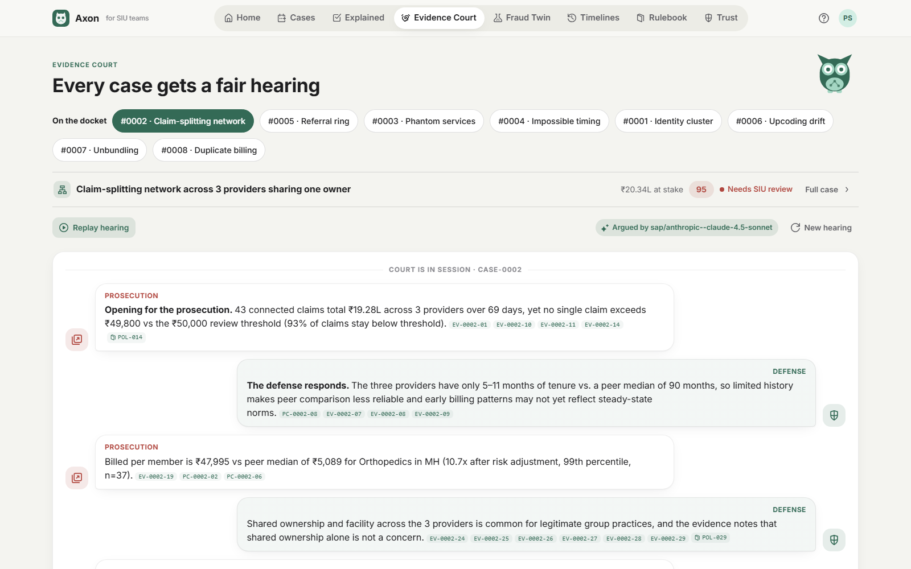

### Explained
Alerts the engine cleared, and the innocent explanation that fit the facts.
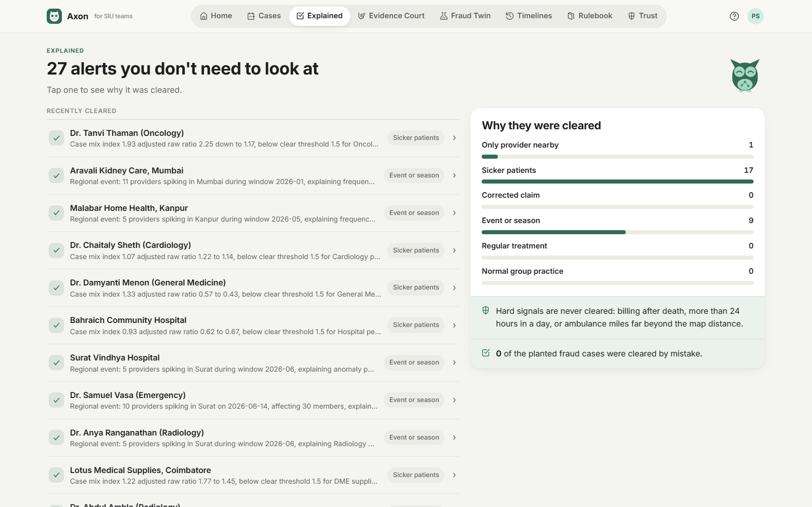

### Fraud Twin
Try to beat the detector: pick or describe a scheme, see how many fakes each method catches, why some slipped through, and the fix Axon suggests.
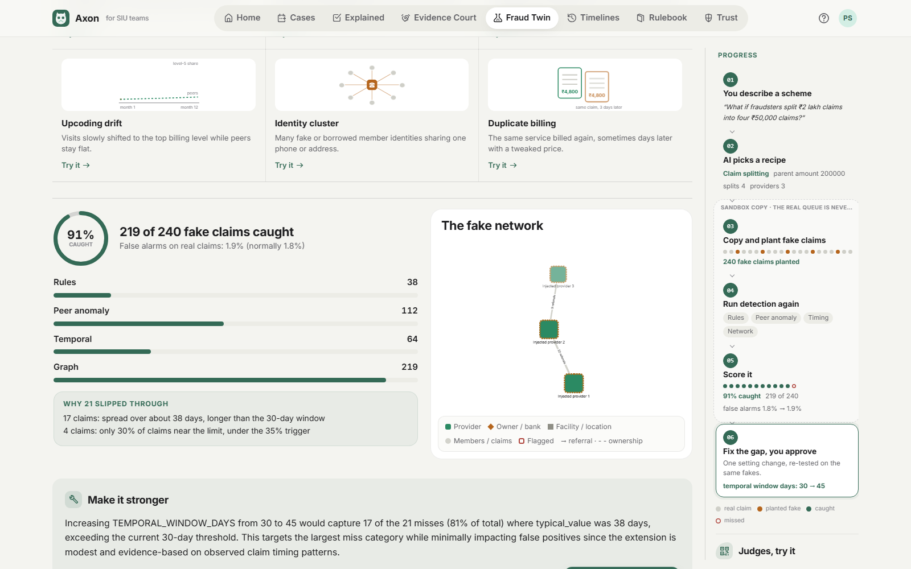

### Two Timelines
The same case, the same dates, with and without Axon: money paid out and lost vs. held before it leaves.
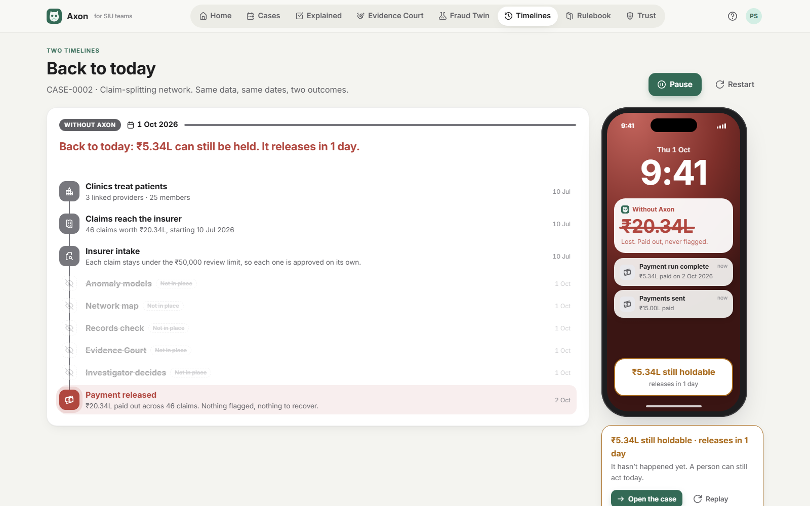

### Rulebook
The 33 synthetic payer rules and 10 paraphrased Indian law summaries the agents may cite, retrieved per case (BM25 RAG).
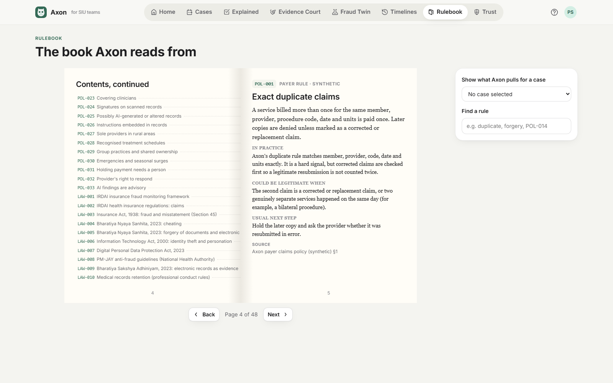

### Trust
Recall, precision, honest look-alikes left alone, forecast calibration, fairness by provider size and a golden set, all measured against the planted ground truth.
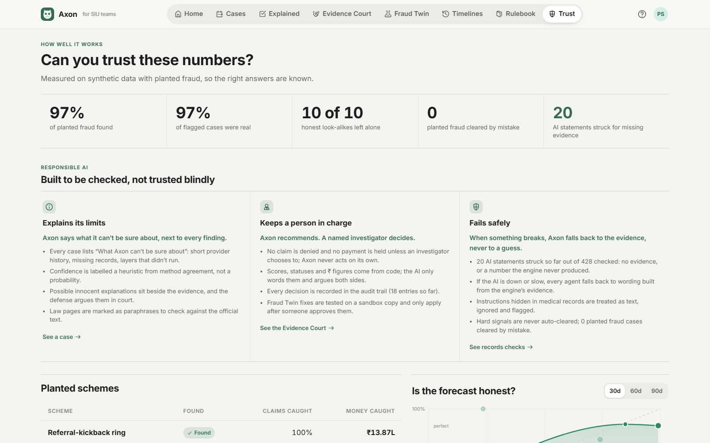

---

## How it works

```
 synthetic claims ──► detection engine ──► evidence ──► cases ──► queue optimizer ──► SIU investigator
 (seeded, 50k lines)   rules · anomaly        (EV-ids,     risk,      (CP-SAT, real        decides: open,
                       temporal · graph        sources)    forecast    hours)               hold, request,
                       exonerations                                                         clear
                                    │
                                    └──► AI agents (explain & argue only) ──► citation verifier ──► UI
                                         court · brief · records · twin · ask    strikes anything uncited
                                         + RAG over the rulebook                 or with numbers the engine
                                                                                 never produced
```

- **Code decides** every score, rank, status and ₹ figure. Thresholds live in `backend/engine/config.py`.
- **AI explains and argues.** Agents only see the evidence for one case plus the rulebook pages retrieved for it. Every statement must cite evidence; the verifier strikes the rest.
- **A person decides.** No auto-deny, no auto-hold. Every decision goes to the audit trail.
- **Deterministic.** Data and pipeline are seeded (`SEED=42`); AI calls are cached.

**Stack:** FastAPI · pandas · scikit-learn · NetworkX · OR-Tools CP-SAT · SAP AI Core (Generative AI Hub) with Gemini / Ollama fallbacks · React 18 · TypeScript · Vite · Recharts · Cytoscape.js · cobe

---

## Responsible AI

| Commitment | How |
|---|---|
| **Explains its limits** | Every case lists what Axon can't be sure about (short history, missing records, layers that didn't run). Confidence is a heuristic from method agreement, not a probability. Law pages are marked as paraphrases |
| **Keeps a person in charge** | Axon recommends; a named investigator decides. Fraud Twin fixes only apply after approval. Everything is logged |
| **Fails safely** | Uncited AI statements and invented numbers are struck. If the AI is down, every agent falls back to wording built from the engine's evidence. Prompt injections in records are ignored and flagged |

---

## Run it

Needs **Python 3.11+** and **Node 20+**. From the repo root:

```bash
npm start
```

Or double-click **`start.bat`** on Windows (it also opens the browser).

The first run sets everything up: Python environment, packages, synthetic data and the detection pipeline (a few minutes, once). After that it starts the API on port 8000 and the website on http://localhost:5173, and prints a link (and QR on the Fraud Twin page) so others on the same Wi-Fi can open it on their phones. `Ctrl + C` stops both.

**AI (optional).** Without credentials every agent runs on deterministic templates, and the UI says so. To use live models, put a SAP AI Core service key at `backend/aicore-key.json`, or set `GEMINI_API_KEY` in `backend/.env` (see `.env.example`). Both are git-ignored.

**Manual commands** (from `backend/`):

```bash
pip install -r requirements.txt
python -m engine.generate --seed 42
python -m engine.pipeline
uvicorn main:app --reload --port 8000
pytest -q
```

Frontend (from `frontend/`): `npm install`, then `npm run dev`.

---

## Repo layout

```
HackForge/
  backend/
    main.py          FastAPI app: /api -> engine, /api/ai -> genai
    engine/          detection, scoring, forecast, queue, Fraud Twin engine, trust, audit
    genai/           agents, gateway, citation verifier, RAG rulebook, templates
    tests/           engine + genai tests
  frontend/          React + Vite UI
  contracts/         example JSON for every API response (the contract)
  docs/              engine spec, API contract, screenshots
  data/reference/    committed synthetic code tables and cities
  data/raw, processed, state, llm_cache   generated, git-ignored
```

Docs: [API contract](docs/CONTRACT.md) · [Engine spec](docs/PART_A_ENGINE.md) · [Engine setup](docs/START_HERE_PART_A.md)

---

## Team

| | Owns |
|---|---|
| **Vaibhav** | Detection engine: data generator, rules, anomaly, temporal, graph, scoring, forecast, queue optimizer, Fraud Twin engine, trust metrics, audit (`backend/engine/`) |
| **Armaan** | GenAI and UI: agents, gateway, citation verifier, RAG rulebook, every screen (`backend/genai/`, `frontend/`) |

The two halves meet at `contracts/`: the engine returns exactly those shapes; the UI is built against them.
